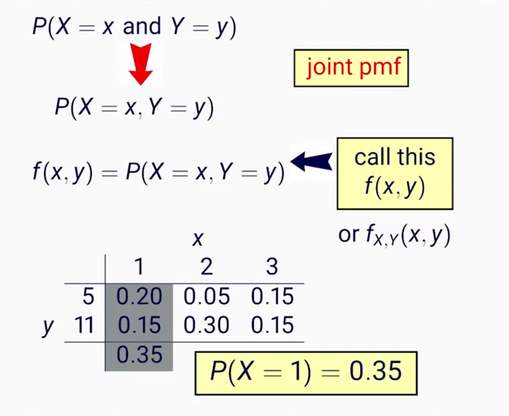
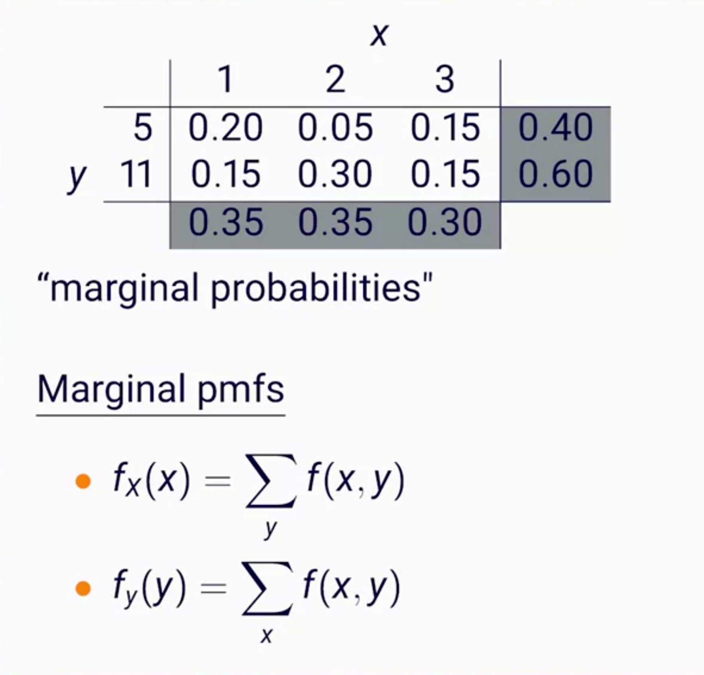
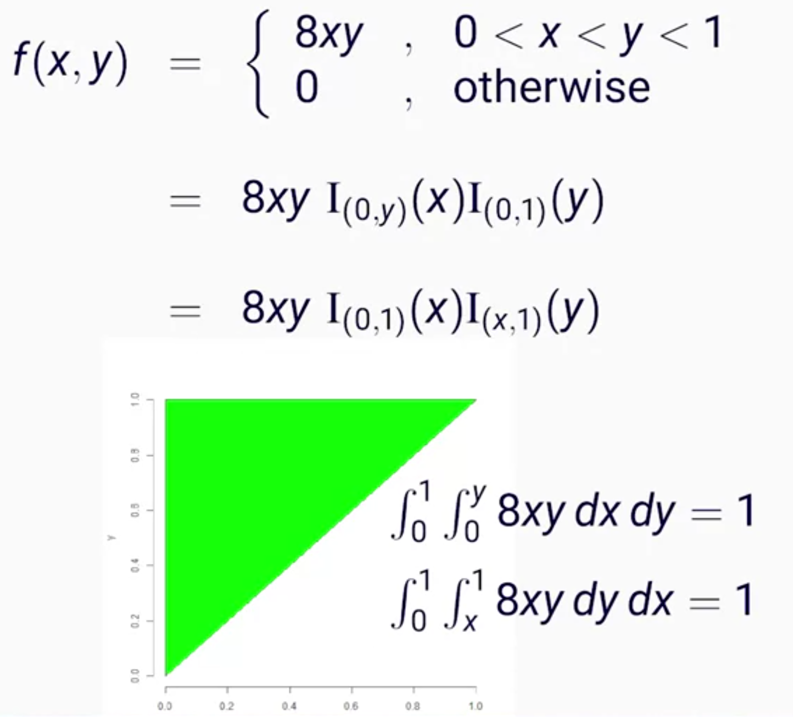
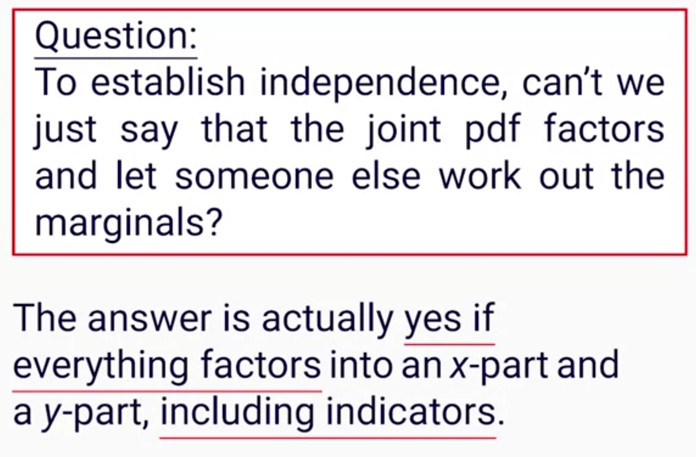

::: {.column-margin}


[Transcript](01_joint-distributions-and-independence.en.txt){target="_blank"}
[Handout](02_joint-distributions_c2_m1l2.pdf){width=700 height=980}
:::


Note: the handout isn't the slides but a reading I've added its contents below.
I might add the slides later - but I cover thier gist in the reflection.

## Joint Distributions Reading {#sec-joint-handout}

{.column-margin}

in the first slide we covered

1. Joint event structure being based on an event for RV X and an event for RV Y. (The joint event is the intersection of the two events.) as defined in @def-joint-probability
2. The notation where the comma is read as "and" and the vertical bar is read as "given" (conditional probability). as defined in @def-joint-probability
3. The tabular representation of a discrete joint distributions and how we just look up the probability of a joint event in the table. 
4. The marginal distributions are obtained by summing out the other variable. as defined in @exm-discrete-joint-table and @def-discrete-marginals

{.column-margin}

::: {#exm-discrete-joint-distribution-with-marginals}
## The First Discrete Joint Distribution

Consider the following joint distribution:

<style>
  .marginal {
    background-color: #f0f0f0;
  }
</style>

| $y \backslash x$ | $1$ | $2$ | $3$ | $P(Y=y)$ |
|---:|---:|---:|---:|---:|:---:|
| $5$ | $0.20$ | $0.05$ | $0.15$ | [$0.40$]{.marginal} |
| $11$| $0.15$ | $0.30$ | $0.15$ | [$0.60$]{.marginal} |
| $P(X=x)$ | [$0.35$]{.marginal} | [$0.40$]{.marginal} | [$0.25$]{.marginal} | [$1.00$]{.marginal} |
: Joint distribution of $X$ and $Y$ with marginal distributions.
:::


5. The marginal distributions are obtained by summing out the other variable as defined in @def-discrete-marginals

{.column-margin}

6. For continuous random variables, we define the **joint probability density function** (joint PDF) instead of a joint PMF. See @def-joint-pdf for details.

::: {#exm-joint-pdf-example-1}
### Joint PDF formula

The event $X\leq Y$ is the half-plane on or above the line $y=x$. Integrating first with respect to $y$ gives

$$
\begin{aligned}
P(X\leq Y)
&= 
\begin{cases}
  8xy   & 0<x<1,y<1 \\
  0     & \text{otherwise}
\end{cases} \\
&= 8xy \mathbb{I}_{(0,y)}(x)\mathbb{I}_{(0,1)}(y) \\
&= 8xy \mathbb{I}_{(0,1)}(x)\mathbb{I}_{(x,1)}(y)
\end{aligned}
$$
:::

Jem hinted the plot was a simplification and I was intrigued about the true form of this joint PDF as I did not think the triangular shape is quite representitive so I tried to make a 3D plot of the joint PDF. 

The code is below and the plot are @fig-joint-pdf-triangular-mesh. What I see is a slightly curved surface, like a tent hung using a pole at (1,1) and with pegs at (1,0), (0,1). 

We will later note that this creates a joint distribution that is not independent, and we will see that the tent shape is a result of the fact that the joint PDF is not a product of two marginal PDFs.


```{r}
#| label: fig-joint-pdf-triangular-mesh
#| fig-cap: "Joint density $f_{X,Y}(x,y)=8xy$ on the triangular support $0<x<y<1$."
#| warning: false
#| message: false
#| code-fold: true

library(plotly)

n <- 60

# Construct vertices row by row on the triangular domain:
# y_j = j/n and x ranges from 0 to y_j.
vertices <- do.call(
  rbind,
  lapply(0:n, function(j) {
    y <- j / n
    data.frame(
      row = j,
      col = 0:j,
      x = seq(0, y, length.out = j + 1),
      y = y
    )
  })
)

vertices$z <- 8 * vertices$x * vertices$y
vertices$id <- seq_len(nrow(vertices)) - 1  # plotly uses zero-based indices

# Convert a row/column location into its vertex index.
vertex_id <- function(row, col) {
  row * (row + 1) / 2 + col
}

triangles <- list()

for (j in 0:(n - 1)) {
  for (k in 0:j) {
    # Upward-pointing triangle
    triangles[[length(triangles) + 1]] <- c(
      vertex_id(j,     k),
      vertex_id(j + 1, k),
      vertex_id(j + 1, k + 1)
    )

    # Downward-pointing triangle
    if (k < j) {
      triangles[[length(triangles) + 1]] <- c(
        vertex_id(j,     k),
        vertex_id(j,     k + 1),
        vertex_id(j + 1, k + 1)
      )
    }
  }
}

triangles <- do.call(rbind, triangles)

plot_ly(
  type = "mesh3d",
  x = vertices$x,
  y = vertices$y,
  z = vertices$z,
  i = triangles[, 1],
  j = triangles[, 2],
  k = triangles[, 3],
  intensity = vertices$z,
  hovertemplate = paste(
    "x = %{x:.3f}",
    "<br>y = %{y:.3f}",
    "<br>f(x,y) = %{z:.3f}",
    "<extra></extra>"
  )
) |>
  layout(
    scene = list(
      xaxis = list(title = "x", range = c(0, 1)),
      yaxis = list(title = "y", range = c(0, 1)),
      zaxis = list(title = "f(x,y)", range = c(0, 8)),
      aspectratio = list(x = 1, y = 1, z = 0.8),
      camera = list(
        eye = list(x = 1.6, y = -1.8, z = 1.1)
      )
    )
  )
```

We can integrate the joint PDF over the triangular support to verify that it is normalized:

$$
\int_0^1 \int_0^y 8xy \, dx \, dy = 1.
$$

or equivalently, we can integrate over the triangular support in the other order:

$$  
\int_0^1 \int_x^1 8xy \, dy \, dx = 1.
$$


note: that a flat triangular surface would require a joint PDF of the form $f(x,y)=a+bx+cy$ for some constants $a$, $b$, and $c$ on the triangular support.

7. The marginals from the example @exm-joint-pdf-example-1 are obtained by integrating out the other variable as defined in @def-continuous-marginals.

:::{#exm-joint-pdf-example-1-marginals}
### Marginal PDFs from the Joint PDF

let's integrate out $Y$ to get the marginal PDF of $X$ and integrate out $X$ to get the marginal PDF of $Y$.
$$
\begin{aligned}
f_y(y) &= \int_0^1 8xy \mathbb{I}_{(0,1)}(x)\mathbb{I}_{(x,1)}(y) \, dx \\
       &= \mathbb{I}_{(0,1)}(y) 8y \int_0^y y \, dx\\
        &= \mathbb{I}_{(0,1)}(y) 8y \left[ xy \right]_0^y  \\
        &= \mathbb{I}_{(0,1)}(y) 8y \cdot \frac12y^2 \\
        &= \mathbb{I}_{(0,1)}(y) 4y^3
\end{aligned}
$$

now let's integrate out $X$ to get the marginal PDF of $Y$ and integrate out $Y$ to get the marginal PDF of $X$.

$$
\begin{aligned}
f_x(x) &= \int_0^1 8xy \mathbb{I}_{(0,1)}(x)\mathbb{I}_{(x,1)}(y) \, dy \\
       &= \mathbb{I}_{(0,1)}(x) 8x \int_0^y y \, dy\\
       &= \mathbb{I}_{(0,1)}(x) \cancel8x \frac12[(1-y^2) ]^1_x  \\
       &= \mathbb{I}_{(0,1)}(x) 4x [(1-x^2) - \cancel{(1-1^2)} ] \\
       &= \boxed{ \mathbb{I}_{(0,1)}(x) 4x (1-x^2) }
\end{aligned}
$$
:::

8. note that the product of the marginals is not equal to the joint PDF, so $X$ and $Y$ are not independent.

$$
f_x(x)f_y(y) = 8xy^2 \mathbb{I}_{(0,1)}(x)\mathbb{I}_{(0,1)}(y) \neq 8xy \mathbb{I}_{(0,1)}(x)\mathbb{I}_{(x,1)}(y) = f_{X,Y}(x,y)
$$


::: {#exm-independent-continuous}
## Independent Continuous Random Variables

Consider the joint density

$$
f_{X,Y}(x,y) = xy,\mathbb{I}_{(0,1)}(x)\mathbb{I}_{(0,2)}(y)
$$

The marginal density of $X$ is

$$
\begin{aligned}
f_X(x)
&= \int_{-\infty}^{\infty} f_{X,Y}(x,y),dy \\
&= x\mathbb{I}_{(0,1)}(x) \int_0^2 y,dy \\
&= x\mathbb{I}_{(0,1)}(x) \left[\frac{y^2}{2}\right]_0^2 \\
&= 2x\mathbb{I}_{(0,1)}(x)
\end{aligned}
$$

Similarly, the marginal density of $Y$ is

$$
\begin{aligned}
f_Y(y)
&= \int_{-\infty}^{\infty} f_{X,Y}(x,y),dx \\
&= y\mathbb{I}_{(0,2)}(y) \int_0^1 x,dx \\
&=  y\mathbb{I}_{(0,2)}(y) \left[\frac{x^2}{2}\right]_0^1 \\
&= \frac{y}{2}\mathbb{I}_{(0,2)}(y)
\end{aligned}
$$

Their product is

$$
\begin{aligned}
f_X(x)f_Y(y)
&= \left[ 2x\mathbb{I}_{(0,1)}(x) \right] \left[ \frac{y}{2}\mathbb{I}_{(0,2)}(y) \right] \\
&= xy, \mathbb{I}_{(0,1)}(x) \mathbb{I}_{(0,2)}(y) \\
&= f_{X,Y}(x,y)
\end{aligned}
$$

Therefore, $X$ and $Y$ are independent.
:::

{.column-margin}

9.  ​After this Jem asks : "to establish independence, ​do we really need to integrate to find the marginal PDFs? ​or can we just say ​this joint PDF factors into an x part and ​y part and let someone else work out ​the constants if they want the marginal PDFs?" and answers "yes if you include Indicators". 
  - but in the first example they are not independent.
  - while in the second one they do.
10. This is covered in [@casella2002statistical §4.2, Lemma 4.3.7 ]

The source addresses the shortcut for establishing independence in **Section 4.2, specifically in Lemma 4.2.7 and the subsequent discussion on support sets**.

::: {.callout-tip}

### The Factorization Shortcut (Lemma 4.2.7)
The textbook explicitly covers the idea that you do not need to calculate marginal PDFs to establish independence. **Lemma 4.2.7** states that $X$ and $Y$ are independent if and only if there exist functions $g(x)$ and $h(y)$ such that, for every $x$ and $y$, the joint PDF/PMF factors as:
$$f(x, y) = g(x)h(y)$$
The proof of this lemma demonstrates that if such a factorization exists, the marginals are simply proportional to $g(x)$ and $h(y)$, and the constants will naturally work themselves out to ensure the marginals integrate to 1. This is illustrated in **Example 4.2.8**, where independence is confirmed for a joint PDF simply by identifying an $x$ part and a $y$ part without performing any integration.

**The Role of Indicators and Support Sets**

The source highlights that this factorization must hold for **all** $x$ and $y$, which is where the "Indicators" mentioned in your query become critical. 

*   **Cross-Product Requirement:** For $X$ and $Y$ to be independent, the **support set** (the set where $f(x, y) > 0$) must be a **cross-product** of the form $A \times B$. 
*   **Indicator Functions:** The source explains that if the joint PDF is written using indicator functions, the indicators themselves must factor into an $x$ part and a $y$ part. 
*   **Failure of Independence:** If the range of $x$ depends on $y$ (e.g., $0 < x < y < \infty$), the support is not a cross-product. In such cases, the variables are dependent even if the "formula" part of the PDF seems to factor. 

For example, the text notes that the joint PDF in **Example 4.2.4** ($f(x, y) = e^{-y}$ for $0 < x < y < \infty$) describes dependent variables because the support set is not a cross-product—you cannot check membership in that set without comparing $x$ and $y$ simultaneously.
:::


## Joint Distributions Reading {#sec-joint-distributions}

::: {#def-joint-probability}
## Joint Probability

Let $X$ and $Y$ be discrete random variables. The probability that $X=x$ and $Y=y$ occur at the same time is the **joint probability**

$$
P(X=x, Y=y).
$$

The comma here is read as “and”
:::

### Event-Based Probability Rules {#sec-event-based-probability-rules}

Joint probabilities obey the usual probability rules for events. In particular, $P(X=x,Y=y)$ can be viewed as $P(A\cap B)$, where

$$
\begin{aligned}
A &= \{X=x\}, \\
B &= \{Y=y\}.
\end{aligned}
$$

::: {#exm-die-events}
### Events from a Die Roll

Suppose a fair six-sided die is rolled. Let

$$
\begin{aligned}
A &= \{2,4,6\}, &&\text{the outcome is even}, \\
B &= \{4,5,6\}, &&\text{the outcome is at least }4.
\end{aligned}
$$

Then

$$
\begin{aligned}
A\cup B &= \{2,4,5,6\}, \\
A\cap B &= \{4,6\}.
\end{aligned}
$$
:::

For any two events $A$ and $B$,

$$
P(A\cup B) = P(A)+P(B)-P(A\cap B).
$$ {#eq-inclusion-exclusion}

The intersection is subtracted because it is counted once in $P(A)$ and once in $P(B)$.

{#fig-venn-union fig-alt="A Venn diagram with two overlapping circles labeled A and B; both circles are shaded to represent their union." width="45%"}

### Discrete Joint Distributions {#sec-discrete-joint-distributions}

Relatively few discrete joint distributions have standard names. They are often specified directly by a table of probabilities.

::: {#def-joint-pmf}
### Joint Probability Mass Function

The **joint probability mass function** (joint PMF) of discrete random variables $X$ and $Y$ is

$$
f(x,y) = P(X=x,Y=y).
$$
:::

::: {#exm-discrete-joint-table}
### A Discrete Joint Distribution

Consider the following joint distribution:

| $y \backslash x$ | $1$ | $2$ | $3$ |
|---:|---:|---:|---:|
| $-5$ | $0.20$ | $0.10$ | $0.05$ |
| $6$  | $0.15$ | $0.30$ | $0.20$ |

Each entry gives the probability associated with its row and column values. For example,

$$
P(X=2,Y=6)=0.30.
$$
:::

### Summing Out a Variable {#sec-discrete-summing-out}

To find the probability of $X=2$ without restricting $Y$, add the probabilities of all disjoint outcomes having $X=2$:

$$
\begin{aligned}
P(X=2)
&= P(X=2,Y=-5) + P(X=2,Y=6) \\
&= 0.10+0.30 \\
&= 0.40.
\end{aligned}
$$

Adding row and column sums places the one-variable distributions in the margins:

| $y \backslash x$ | $1$ | $2$ | $3$ | $P(Y=y)$ |
|---:|---:|---:|---:|---:|
| $-5$ | $0.20$ | $0.10$ | $0.05$ | $0.35$ |
| $6$  | $0.15$ | $0.30$ | $0.20$ | $0.65$ |
| $P(X=x)$ | $0.35$ | $0.40$ | $0.25$ | $1.00$ |

Thus the marginal distribution of $X$ is

| $x$ | $1$ | $2$ | $3$ |
|---:|---:|---:|---:|
| $P(X=x)$ | $0.35$ | $0.40$ | $0.25$ |

and the marginal distribution of $Y$ is

| $y$ | $-5$ | $6$ |
|---:|---:|---:|
| $P(Y=y)$ | $0.35$ | $0.65$ |

::: {#def-discrete-marginals}
### Marginal Probability Mass Functions

The marginal PMF of $X$ is obtained by summing the joint PMF over all possible values of $Y$:

$$
f_X(x) = \sum_y f(x,y).
$$

Similarly, the marginal PMF of $Y$ is obtained by summing over all possible values of $X$:

$$
f_Y(y) = \sum_x f(x,y).
$$
:::

The subscript distinguishes the two marginal PMFs while retaining $f(x,y)$ for the joint PMF.

### Continuous Joint Distributions {#sec-continuous-joint-distributions}

Suppose now that $X$ and $Y$ are continuous random variables. As in the univariate continuous case,

$$
P(X=x,Y=y)=0
$$

for every particular pair $(x,y)$.

::: {#def-joint-pdf}
## Joint Probability Density Function

A joint probability density function (joint PDF) $f(x,y)$ is a surface whose volume over a region represents probability. It must satisfy

$$
f(x,y)\geq 0
$$

and

$$
\int_{-\infty}^{\infty}
\int_{-\infty}^{\infty}`
f(x,y)\,dy\,dx
= 1.
$$
:::

Probabilities involving $X$ and $Y$ are obtained by integrating the joint density over the corresponding region in the $xy$-plane.

::: {#exm-rectangular-region}
## Probability over a Rectangular Region

For the event $X\leq 1$ and $2<Y<6$,

$$
P(X\leq 1,2<Y<6)
=
\int_{-\infty}^{1}
  \int_{2}^{6}
    f(x,y)\,dy\,dx.
$$
:::

::: {#exm-ordering-region}
## Probability That $X\leq Y$

The event $X\leq Y$ is the half-plane on or above the line $y=x$. Integrating first with respect to $y$ gives

$$
P(X\leq Y)
=
\int_{-\infty}^{\infty}
  \int_{x}^{\infty}
    f(x,y)\,dy\,dx.
$$

Equivalently, integrating first with respect to $x$ gives

$$
P(X\leq Y)
=
\int_{-\infty}^{\infty}
  \int_{-\infty}^{y}
    f(x,y)\,dx\,dy
$$

Drawing the region $x\leq y$ in the $xy$-plane helps determine the integration limits.
:::

::: {#def-continuous-marginals}
## Marginal Probability Density Functions

The marginal PDF of $X$ is obtained by integrating out $Y$:

$$
f_X(x) = \int_{-\infty}^{\infty} f(x,y)\,dy
$$

The marginal PDF of $Y$ is obtained by integrating out $X$:

$$
f_Y(y)
=
\int_{-\infty}^{\infty}
f(x,y)\,dx.
$$
:::

If the joint density is zero outside a restricted support, the integrals over $(-\infty,\infty)$ can be replaced by integrals over the corresponding finite region. Examples are developed in the video associated with this lesson.
The indicator functions specify the support, but they are not by themselves sufficient. The factors must also be nonnegative, integrable, and jointly normalized.

## Independence for Continuous Random Variables {#sec-independent-continuous}

::: {#def-independent-continuous}
## Independence for Continuous Random Variables

Continuous random variables $X$ and $Y$ are independent if and only if their joint probability density function factors as

$$
f_{X,Y}(x,y)=f_X(x)f_Y(y)
$$

for all $(x,y)$, except possibly on a set of measure zero.
:::

This is analogous to independence for discrete random variables: the joint density factors into the product of the marginal densities.

::: {#exm-independent-continuous}
## Independent Continuous Random Variables

Consider the joint density

$$
f_{X,Y}(x,y) = xy,\mathbb{I}_{(0,1)}(x)\mathbb{I}_{(0,2)}(y)
$$

The marginal density of $X$ is

$$
\begin{aligned}
f_X(x)
&= \int_{-\infty}^{\infty} f_{X,Y}(x,y),dy \\
&= x\mathbb{I}_{(0,1)}(x) \int_0^2 y,dy \\
&= x\mathbb{I}_{(0,1)}(x) \left[\frac{y^2}{2}\right]_0^2 \\
&= 2x\mathbb{I}_{(0,1)}(x)
\end{aligned}
$$

Similarly, the marginal density of $Y$ is

$$
\begin{aligned}
f_Y(y)
&= \int_{-\infty}^{\infty} f_{X,Y}(x,y),dx \\
&= y\mathbb{I}_{(0,2)}(y) \int_0^1 x,dx \\
&=  y\mathbb{I}_{(0,2)}(y) \left[\frac{x^2}{2}\right]_0^1 \\
&= \frac{y}{2}\mathbb{I}_{(0,2)}(y)
\end{aligned}
$$

Their product is

$$
\begin{aligned}
f_X(x)f_Y(y)
&= \left[ 2x\mathbb{I}_{(0,1)}(x) \right] \left[ \frac{y}{2}\mathbb{I}_{(0,2)}(y) \right] \\
&= xy, \mathbb{I}_{(0,1)}(x) \mathbb{I}_{(0,2)}(y) \\
&= f_{X,Y}(x,y)
\end{aligned}
$$

Therefore, $X$ and $Y$ are independent.
:::

::: {.callout-tip}
## Factorization Shortcut

It is not necessary to calculate both marginal densities explicitly whenever the joint density has the form

$$
f_{X,Y}(x,y) = g(x)h(y)
$$

on a Cartesian product support.

Let

$$
G = \int_{-\infty}^{\infty} g(x),dx, \qquad H = \int_{-\infty}^{\infty} h(y),dy.
$$

Because $f_{X,Y}$ is a normalized joint density,

$$
GH= \int_{-\infty}^{\infty} \int_{-\infty}^{\infty} g(x)h(y),dy,dx = 1
$$

The marginal densities are therefore

$$
f_X(x)=H g(x), \qquad f_Y(y)=G h(y),
$$

and hence

$$
f_X(x)f_Y(y)= GH g(x)h(y) = g(x)h(y) = f_{X,Y}(x,y)
$$

Thus, factorization into nonnegative, integrable functions on a product support is sufficient to establish independence. 
:::


The factors $g$ and $h$ need not themselves be normalized marginal densities.

In this example,

$$
g(x)=x\mathbb{I}_{(0,1)}(x),
\qquad
h(y)=y\mathbb{I}_{(0,2)}(y),
$$

with

$$
G=\frac12, \qquad H=2.
$$

Consequently,

$$
f_X(x)=2g(x) \qquad f_Y(y)=\frac12 h(y)
$$

---

Quesion: can we just show that the joint PDF factors into the product and let someone else show that the marginals are correct?

The answer is yes so long as the marginals have well defined indicator functions. 

### Reflection 

1. **Joint distributions** are what we usually think about in multivariate statistics. Univariate distributions are very useful models but I consider them as the first step in building blocks for more complex statistical models that capture relationships between multiple variables.

2. **Independence and conditioning are related concepts** When considered in measure theoretic probability theory one can see that they are two sides of the same coin. Conditioning means the two RVs can't be factored as a separate product of their marginals, while independence means they can.

3. **Graphical models and Bayesian networks** One of the more interesting notions I learned about in graphical models and bayesian networks is that we can combine factors i.e. small joint distributions over subsets of variables to get a joint distribution over all the variables. If a big joint distribution can be factored into smaller joint distributions it means

  1. that we can reason about each block as a sub-system that is independent of the other blocks.
  2. that there are lots of empty blocks in the big joint distribution that are zero - so that we can infer its parameters from less data and with less computational resources.

4. **The EM algorithm for fitting mixture models** is a good example of how we can use the factorization of the joint distribution to make inference tractable.
