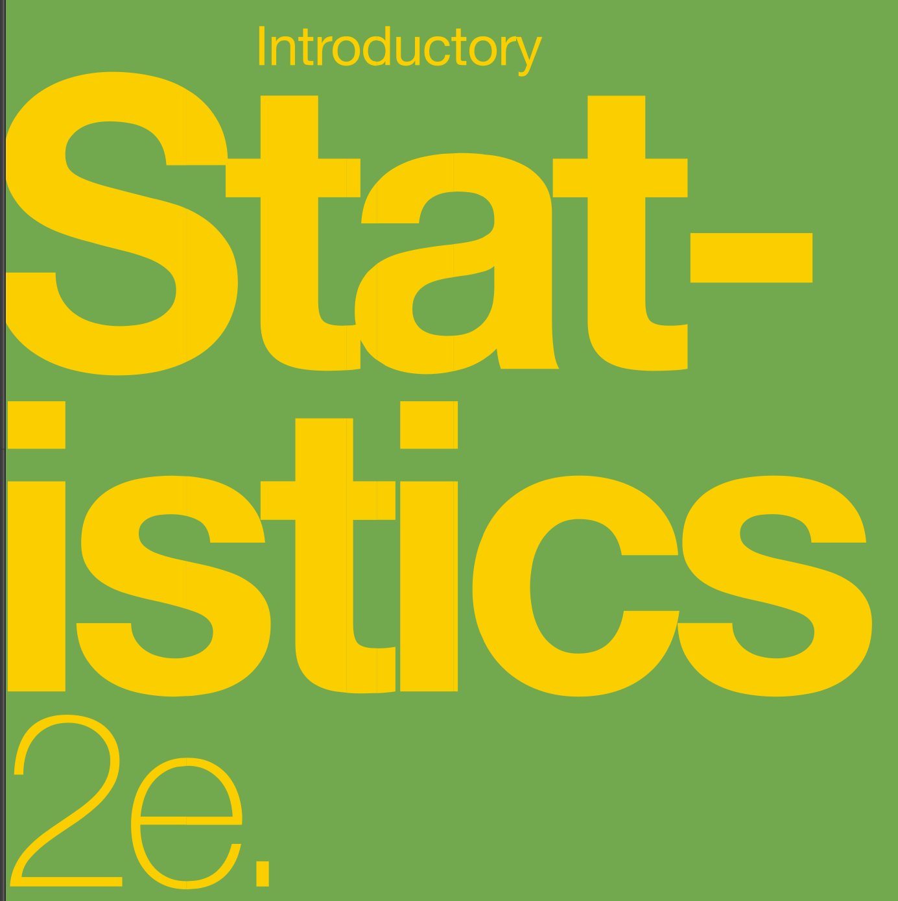
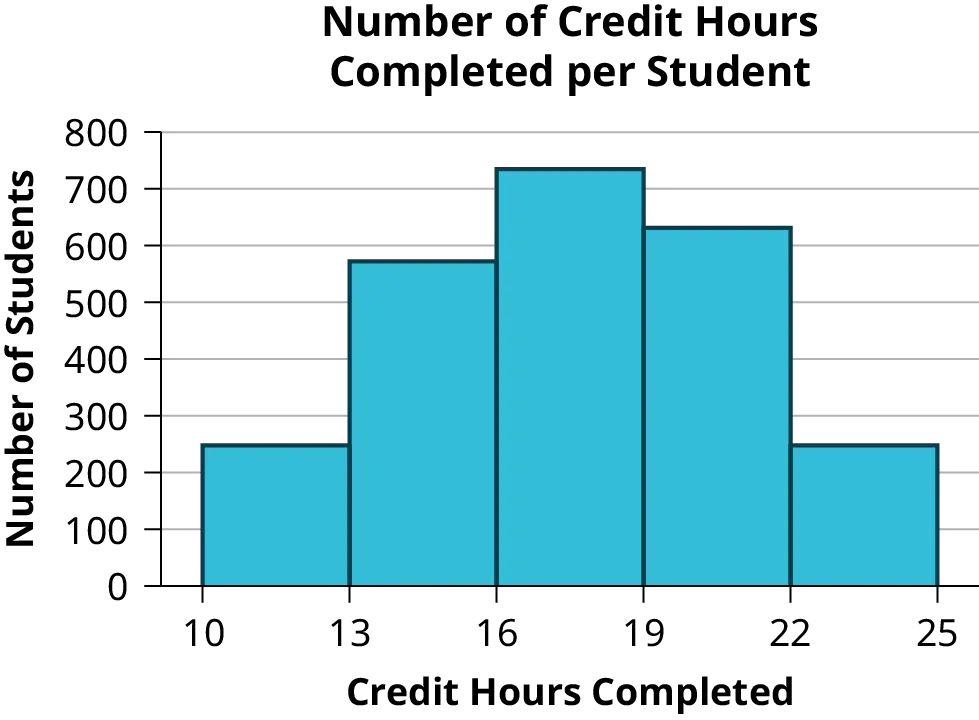

# OpenStax Introductory Statistics 2e

## Chapter 1. Sampling and Data

### Section 1. Definitions of Statistics, Probability and Key Terms

::: {#exr-try-01}
Determine what the key terms refer to in the following study. We want to know the average (mean) amount of money spent on school uniforms each year by families with children at Knoll Academy. We randomly survey 100 families with children in the school. Three of the families spent \$65, \$75, and \$95, respectively.
:::

::: {.callout-tip collapse="true"}
#### Solution

-   The population is all families with children attending Knoll Academy.
-   The sample is a random selection of 100 families with children attending Knoll Academy.
-   The parameter is the average (mean) amount of money spent on school uniforms by families with children at Knoll Academy.
-   The statistic is the average (mean) amount of money spent on school uniforms by families in the sample.
-   The variable is the amount of money spent by one family. Let X = the amount of money spent on school uniforms by one family with children attending Knoll Academy.
-   The data are the dollar amounts spent by the families. Examples of the data are \$65, \$75, and \$95.
:::

------------------------------------------------------------------------

### Section 2. Data, Sampling, and Variation in Data and Sampling

::: {#exr-try-02}
Determine what key terms refer to in the following study.  A survey of athletes in a university was conducted to study the heights of athletes, in meters. Fill in the letter of the phrase that best describes each of the items below. 

:::: {.columns}
::::: {.column width="40%"}
1.  Population \_\_\_\_ 
2.  Statistics \_\_\_\_ 
3.  Parameter \_\_\_\_ 
4.  Sample \_\_\_\_ 
5.  Variable \_\_\_\_ 
6.  Data \_\_\_\_\_   
:::::

::::: {.column width="60%"}
a.  the average height of athletes in the university 
b.  the average height of athletes in the survey 
c.  all athletes in the university 
d.  all students in the university 
e.  the height of one athlete 
f.  a group of athletes randomly selected 
g.  1.82, 1.76, 1.69, 1.93 
:::::
::::
:::

::: {.callout-tip collapse="true"}
#### Solution

1.  c 
2.  b 
3.  a 
4.  f 
5.  e 
6.  g
:::

::: {#exr-try-03}
Determine what the key terms refer to in the following study.  

A survey is conducted to check the time taken by a mobile for charging of battery from 50% to 100%. 

The criteria used to collect the data are: 

| $x$     | $P(x)$ | $x\times P(x)$ |
|-------|------|---------|
| Red   |      |         |
| Blue  |      |         |
| Green | 10   |         |

: Table 4.11

| Wattage of charger used | Type of mobile used |
|:-----------------------:|:-------------------:|
|          30 W           |       Android       |

: Criteria {#tbl-1.1 .striped .hover}

We want to know the proportion of Android mobiles that are charged to 100% within 30 minutes. We start with a simple random sample of 200 mobiles. 
:::

::: {.callout-tip collapse="true"}
#### Solution

-   The **population** is all Android mobiles. 
-   The **sample** is the 200 mobiles, selected by a simple random sample. 
-   The **parameter** is the proportion of Android mobiles that are charged to 100% within 30 minutes in the population. 
-   The **statistic** is the proportion of Android mobiles that are charged to 100% within 30 minutes in the survey. 
-   The **variable** X = the number of Android mobiles that are charged to 100% within 30 minutes. 
-   The **data** are either: yes, charged to 100% within 30 minutes; or no, charged to 100% taking more than 30 minutes. 
:::

::: {#exr-try-04}
Determine what the key terms refer to in the following study.  A study is to be conducted by a news agency to find the proportion of all truck drivers that have no points on their license. The agency selects 1000 truck drivers randomly from the directory of truck drivers and determines the number of truck drivers in the sample who have no points on their license. 
:::

::: {.callout-tip collapse="true"}
#### Solution

-   The **population** is all truck drivers present in the directory. 
-   The **parameter** is the proportion of truck drivers that have no points on their license in the population. 
-   The **sample** is the 1000 truck drivers selected randomly from the directory. 
-   The **statistic** is the proportion of truck drivers that have no points on their license in the sample. 
-   The **variable** X = the number of truck drivers that have no points on their license. 
-   The **data** are either: yes, they have no points on their license; or no, they have points on their license. 
:::

::: {#exr-try-05}
The data are the number of machines in a gym. You sample five gyms. One gym has 12 machines, one gym has 15 machines, one gym has ten machines, one gym has 22 machines, and the other gym has 20 machines. What type of data is this?
:::

::: {.callout-tip collapse="true"}
#### Solution

quantitative discrete data
:::

::: {#exr-try-06}
The data are the areas of lawns in square feet. You sample five houses. The areas of the lawns are 144 sq. feet, 160 sq. feet, 190 sq. feet, 180 sq. feet, and 210 sq. feet. What type of data is this?
:::

::: {.callout-tip collapse="true"}
#### Solution

quantitative continuous data
:::

::: {#exr-try-07}
The following list of materials was purchased by a purchase manager in a company: 

-   Two types of nails (2 kg box nails, 3 kg roofing nails) 
-   One type of oil (4 L machine oil) 
-   Four types of screws (3 kg wood screws, 5 kg machine screws, 1 kg set screws, 2 kg socket screws) 

Name data sets that are quantitative discrete, quantitative continuous, and qualitative. 
:::

::: {.callout-tip collapse="true"}
#### Solution

One possible solution: 

-   The two types of nails, one type of oil, and four types of screws are quantitative discrete data because you count them. 
-   The weights of materials are quantitative continuous data because you can measure weight as precisely as possible. 
-   Types of nails, oil, and screws are qualitative data because they are categorical. 

Try to identify additional data sets in the example.
:::

::: {#exr-try-08}
The data are the colors of houses. You sample five houses. The colors of the houses are white, yellow, white, red, and white. What type of data is this?
:::

::: {.callout-tip collapse="true"}
#### Solution

qualitative data
:::

::: {#exr-try-09}
Determine the correct data type (quantitative or qualitative) for the number of cars in a parking lot. Indicate whether quantitative data are continuous or discrete.
:::

::: {.callout-tip collapse="true"}
#### Solution

quantitative discrete
:::

::: {#exr-try-10}
The registrar at State University keeps records of the number of credit hours students complete each semester. The data collected are summarized in the histogram. The class boundaries are 10 to less than 13, 13 to less than 16, 16 to less than 19, 19 to less than 22, and 22 to less than 25. 

What type of data does this graph show?
:::

::: {.callout-tip collapse="true"}
#### Solution

A histogram is used to display quantitative data: the numbers of credit hours completed. Because students can complete only a whole number of hours (no fractions of hours allowed), this data is quantitative discrete.
:::

::: {#exr-try-11}
You are going to use the random number generator to generate different types of samples from the data.

This table displays six sets of quiz scores (each quiz counts 10 points) for an elementary statistics class.

| #1  | #2  | #3  | #4  | #5  | #6  |
|:---:|:---:|:---:|:---:|:---:|:---:|
|  5  |  7  | 10  |  9  |  8  |  3  |
| 10  |  5  |  9  |  8  |  7  |  6  |
|  9  | 10  |  8  |  6  |  7  |  9  |
|  9  | 10  | 10  |  9  |  8  |  9  |
|  7  |  8  |  9  |  5  |  7  |  4  |
|  9  |  9  |  9  | 10  |  8  |  7  |
|  7  |  7  |  7  | 10  |  9  |  8  |
| 10  |  8  |  7  |  7  |  7  | 10  |
|  9  |  8  |  8  |  8  |  8  |  9  |
|  8  |  9  | 10  |  8  |  8  |  9  |
|  7  |  8  |  7  |  7  |  8  |  8  |
|  8  |  8  |  8  | 10  |  9  |  8  |
|  7  |  7  |  7  |  7  |  7  |  7  |

: Random Numbers {#tbl-1.7 .striped .hover}

Instructions : Use the Random Number Generator to pick samples.

1.  Create a stratified sample by column. Pick three quiz scores randomly from each column.
    -   Number each row one through ten.
    -   On your calculator, press Math and arrow over to PRB.
    -   For column 1, Press 5:randInt( and enter 1,10). Press ENTER. Record the number. Press ENTER 2 more times (even the repeats). Record these numbers. Record the three quiz scores in column one that correspond to these three numbers.
    -   Repeat for columns two through six.
    -   These 18 quiz scores are a stratified sample.
2.  Create a cluster sample by picking two of the columns. Use the column numbers: one through six.
    -   Press MATH and arrow over to PRB.
    -   Press 5:randInt( and enter 1,6). Press ENTER. Record the number. Press ENTER and record that number.
    -   The two numbers are for two of the columns.
    -   The quiz scores (20 of them) in these 2 columns are the cluster sample.
3.  Create a simple random sample of 15 quiz scores.
    -   Use the numbering one through 60.
    -   Press MATH. Arrow over to PRB. Press 5:randInt( and enter 1, 60).
    -   Press ENTER 15 times and record the numbers.
    -   Record the quiz scores that correspond to these numbers.
    -   These 15 quiz scores are the random sample.
4.  Create a systematic sample of 12 quiz scores.
    -   Use the numbering one through 60.
    -   Press MATH. Arrow over to PRB. Press 5:randInt( and enter 1, 60).
    -   Press ENTER. Record the number and the first quiz score. From that number, count ten quiz scores and record that quiz score. Keep counting ten quiz scores and recording the quiz score until you have a sample of 12 quiz scores. You may wrap around (go back to the beginning).
:::

::: {#exr-try-1-12}
#### Sampling type

Determine the type of sampling used 

-   [ ] simple random
-   [ ] stratified
-   [ ] systematic
-   [ ] cluster
-   [ ] convenience

a.  A soccer coach selects six players from a group of boys aged eight to ten, seven players from a group of boys aged 11 to 12, and three players from a group of boys aged 13 to 14 to form a recreational soccer team.
b.  A pollster interviews all human resource personnel in five different high tech companies.
c.  A high school educational researcher interviews 50 high school female teachers and 50 high school male teachers.
d.  A medical researcher interviews every third cancer patient from a list of cancer patients at a local hospital.
e.  A high school counselor uses a computer to generate 50 random numbers and then picks students whose names correspond to the numbers.
f.  A student interviews classmates in their algebra class to determine how many pairs of jeans a student owns, on the average.

:::

::: {.callout-tip collapse="true"}
#### Solution

a.  stratified
b.  cluster
c.  stratified
d.  systematic
e.  simple random
f.  convenience
:::

::: {#exr-try-1-12a}

Determine the type of sampling used:

A high school principal polls 50 first-year students, 50 sophomores, 50 juniors, and 50 seniors regarding policy changes for after school activities.

-   [ ] simple random
-   [ ] stratified
-   [ ] systematic
-   [ ] cluster
-   [ ] convenience

:::

::: {.callout-tip collapse="true"}
#### Solution

stratified
:::

::: {#exr-try-13}
#### Radio Station Sample

A local radio station has a fan base of 20,000 listeners. The station wants to know if its audience would prefer more music or more talk shows. Asking all 20,000 listeners is an almost impossible task. The station uses convenience sampling and surveys the first 200 people they meet at one of the station’s music concert events. 24 people said they’d prefer more talk shows, and 176 people said they’d prefer more music. Do you think that this sample is representative of (or is characteristic of) the entire 20,000 listener population?
:::

::: {.callout-tip collapse="true"}
#### Solution

The sample probably consists more of people who prefer music because it is a concert event. Also, the sample represents only those who showed up to the event earlier than the majority. The sample probably doesn’t represent the entire fan base and is probably biased towards people who would prefer music.
:::

### Section 3. Frequency, Frequency Tables, and Levels of Measurement

::: {#exr-try-14}
@tbl-1.14 shows the amount, in inches, of annual rainfall in a sample of towns.

| Rainfall (Inches) | Frequency | Relative Frequency | Cumulative Relative Frequency |
|:-----------------|:----------------:|:----------------:|:-----------------:|
| 2.95–4.97 | 6 | 6/50 = 0.12 | 0.12 |
| 4.97–6.99 | 7 | 7/50 = 0.14 | 0.12 + 0.14 = 0.26 |
| 6.99–9.01 | 15 | 15/50 = 0.30 | 0.26 + 0.30 = 0.56 |
| 9.01–11.03 | 8 | 8/50 = 0.16 | 0.56 + 0.16 = 0.72 |
| 11.03–13.05 | 9 | 9/50 = 0.18 | 0.72 + 0.18 = 0.90 |
| 13.05–15.07 | 5 | 5/50 = 0.10 | 0.90 + 0.10 = 1.00 |
| **Total** | **50** |  | **1.00** |

: Rainfall Data {#tbl-1.14 .striped .hover}

From @tbl-1.14 , find the percentage of rainfall that is less than 9.01 inches.
:::

::: {.callout-tip collapse="true"}
#### Solution

0.56 or 56%
:::

::: {#exr-try-15}
From @tbl-1.14 , find the percentage of rainfall that is between 6.99 and 13.05 inches.
:::

::: {.callout-tip collapse="true"}
#### Solution

0.30 + 0.16 + 0.18 = 0.64 or 64%
:::

::: {#exr-try-16}
From @tbl-1.14 , find the number of towns that have rainfall between 2.95 and 9.01 inches.
:::

::: {.callout-tip collapse="true"}
#### Solution

6 + 7 + 15 = 28 towns
:::

::: {#exr-try-17}
@tbl-1.14 represents the amount, in inches, of annual rainfall in a sample of towns. What fraction of towns surveyed get between 11.03 and 13.05 inches of rainfall each year?
:::

::: {.callout-tip collapse="true"}
#### Solution

$9/50$
:::

::: {#exr-try-18}
#### Fatal Motor Crashes

@tbl-1.17 contains the total number of fatal motor vehicle traffic crashes in the United States for a period of 18 years.

| Year      | Total Number of Crashes |
|-----------|-------------------------|
| Year 1    | 36,254                  |
| Year 2    | 37,241                  |
| Year 3    | 37,494                  |
| Year 4    | 37,324                  |
| Year 5    | 37,107                  |
| Year 6    | 37,140                  |
| Year 7    | 37,526                  |
| Year 8    | 37,862                  |
| Year 9    | 38,491                  |
| Year 10   | 38,477                  |
| Year 11   | 38,444                  |
| Year 12   | 39,252                  |
| Year 13   | 38,648                  |
| Year 14   | 37,435                  |
| Year 15   | 34,172                  |
| Year 16   | 30,862                  |
| Year 17   | 30,296                  |
| Year 18   | 29,757                  |
| **Total** | **653,782**             |

: Fatal Motor Vehicle Traffic Crashes in the United States {#tbl-1.17 .striped .hover}

Answer the following questions.

a.  What is the **frequency** of deaths measured from Year 7 through Year 11?
b.  What **percentage** of deaths occurred after Year 13?
c.  What is the **relative frequency** of deaths that occurred in Year 7 or before?
d.  What is the **percentage** of deaths that occurred in Year 18?
e.  What is the **cumulative relative frequency** for Year 13? Explain what this number tells you about the data.
:::

::: {.callout-tip collapse="true"}
#### Solution

a.  190,800 (29.2%)
b.  24.9%
c.  260,086/653,782 or 39.8%
d.  4.6%
e.  75.1% of all fatal traffic crashes for 18-year period happened from Year 1 to Year 13.
:::

### Section 4. Experimental Design and Ethics

::: {#exr-try-19}
#### Medical Study

A study needs to be conducted of the effect of three medicines A, B, and C on the height of adults aged 30 to 45. 90 adults were selected randomly and divided into three equal groups. The first group was asked to take medicine A for 6 months. The second group was asked to take medicine B for 6 months. The third group was asked to take medicine C for 6 months. The average change in height in each group is calculated at the end of the study.  Identify the following values for this study: population, sample, experimental units, explanatory variables, response variable, treatments.
:::

::: {.callout-tip collapse="true"}
#### Solution

-   The population is adults aged 30 to 45. 
-   The sample is 90 adults that were selected randomly. 
-   The experimental units are the individual adults in the study. 
-   The explanatory variable is the medicines. 
-   The treatments are medicines A, B, and C. 
-   The response variable is the average change in height in the group.
:::

::: {#exr-try-20}
#### Placebo Research Group

The Placebo Research Group conducted a study to find the extent of placebo effects. 
A group of people randomly selected were asked to take a test before and after taking a pill that induces a mild headache. 
The pill in half of the randomly selected people was replaced with a similar pill that has no effect. 
For each trial, researchers recorded the change in time people took to complete the tests before and after taking the pill. 

a.  Describe the explanatory and response variable in this study. 
b.  What are the treatments? 
c.  Identify any lurking variables that could interfere with this study. 
d.  Is it possible to use blinding in this study?
:::

::: {.callout-tip collapse="true"}
#### Solution

a.  The explanatory variable is the pill, and the response variable is the change in time taken between the two tests. 
b.  There are two treatments: a pill that induces a mild headache and a pill that has no effect. 
c.  All subjects have been given pills. The people for kind of pill intake are randomly selected. Random assignment eliminates the problem of lurking variables. 
d.  Subjects do not know which pill they are taking, so they are blinded in this study. The researchers know which subject is taking which pill, so they cannot be blinded in this study.
:::

::: {#exr-try-21}
#### Texting & Driving

You are concerned about the effects of texting on driving performance. Design a study to test the response time of drivers while texting and while driving only. How many seconds does it take for a driver to respond when a leading car hits the brakes?

a.  Describe the explanatory and response variables in the study.
b.  What are the treatments?
c.  What should you consider when selecting participants?
d.  Your research partner wants to divide participants randomly into two groups: one to drive without distraction and one to text and drive simultaneously. Is this a good idea? Why or why not?
e.  Identify any lurking variables that could interfere with this study.
f.  How can blinding be used in this study?
:::

::: {.callout-tip collapse="true"}
#### Solution

a.  Explanatory: presence of distraction from texting; response: response time measured in seconds
b.  Driving without distraction and driving while texting
c.  Answers will vary. Possible responses: Do participants regularly send and receive text messages? How long has the subject been driving? What is the age of the participants? Do participants have similar texting and driving experience?
d.  This is not a good plan because it compares drivers with different abilities. It would be better to assign both treatments to each participant in random order.
e.  Possible responses include: texting ability, driving experience, type of phone.
f.  The researchers observing the trials and recording response time could be blinded to the treatment being applied.
:::

::: {#exr-try-22}
#### Unethical Behaviour

Describe the unethical behavior, if any, in each example and describe how it could impact the reliability of the resulting data. Explain how the problem should be corrected. A study is commissioned to determine the favorite brand of fruit juice among teens in California.

a.  The survey is commissioned by the seller of a popular brand of apple juice.
b.  There are only two types of juice included in the study: apple juice and cranberry juice.
c.  Researchers allow participants to see the brand of juice as samples are poured for a taste test.
d.  Twenty-five percent of participants prefer Brand X, 33% prefer Brand Y and 42% have no preference between the two brands. Brand X references the study in a commercial saying “Most teens like Brand X as much as or more than Brand Y.”
:::

::: {.callout-tip collapse="true"}
#### Solution

a.  This is not necessarily a problem. The study should be monitored carefully, however, to ensure that the company is not pressuring researchers to return biased results.
b.  If the researchers truly want to determine the favorite brand of juice, then researchers should ask teens to compare different brands of the same type of juice. Choosing a sweet juice to compare against a sharp-flavored juice will not lead to an accurate comparison of brand quality.
c.  Participants could be biased by the knowledge. The results may be different from those obtained in a blind taste test.
d.  The commercial tells the truth, but not the whole truth. It leads consumers to believe that Brand X was preferred by more participants than Brand Y while the opposite is true.
:::
